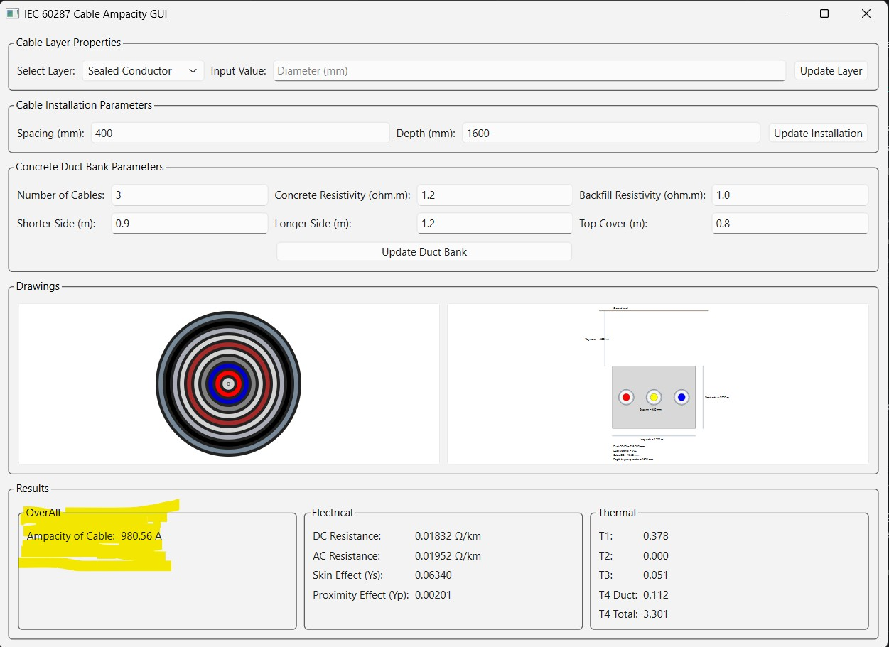

# Cable Ampacity Model (IEC 60287)

A Python-based engineering software implementing steady-state cable ampacity calculations in accordance with **IEC 60287**.

The project combines a modular calculation engine with an interactive **PySide6 desktop GUI** for cable modelling, installation configuration, engineering visualization, and real-time ampacity analysis.

The current validated implementation focuses on **single-core HV cables installed in concrete duct banks**.

---

# Features

### IEC 60287 Calculation Engine

- DC resistance calculation
- AC resistance calculation
- Skin effect (Ys)
- Proximity effect (Yp)
- Thermal resistance calculations (T1, T2, T3, T4)
- Steady-state cable ampacity calculation

### Interactive GUI

- Cable layer editor
- Cable installation parameter editor
- Concrete duct bank editor
- Automatic engineering recalculation
- Cable cross-section visualization
- Concrete duct bank visualization

### Results Panel

The GUI displays:

- Cable ampacity
- DC resistance
- AC resistance
- Skin effect
- Proximity effect
- T1
- T2
- T3
- T4 Duct
- T4 Total

---

# Validation

The IEC 60287 implementation has been verified against engineering calculations from a reputable power engineering company in the Kingdom of Saudi Arabia.

The comparison includes:

- AC resistance
- Thermal resistances
- Total thermal resistance
- Cable ampacity

The calculated results closely match the reference engineering calculations, providing confidence in the implementation of the current IEC 60287 modules.

---

# Methodology

The steady-state cable ampacity is calculated using IEC 60287:

```text
I = √(Δθ / (Rac × Ttotal))
```

Where

```text
Δθ      = Conductor temperature rise
Rac     = AC conductor resistance (Ω/m)
Ttotal  = Total thermal resistance (K·m/W)
```

The electrical model calculates:

```text
Rdc
↓

Skin Effect (Ys)

↓

Proximity Effect (Yp)

↓

Rac
```

The thermal model calculates:

```text
T1
T2
T3
T4

↓

Ttotal
```

These are combined to determine the allowable continuous current (ampacity).

---

# Project Structure

```text
src/
│
├── calculations/
│   └── ampacity_engine.py
│
├── electrical/
│   └── iec_electrical.py
│
├── thermal/
│   └── iec_thermal.py
│
├── models/
│   ├── cable.py
│   ├── installation.py
│   ├── duct.py
│   ├── concrete_duct_bank.py
│   ├── environment.py
│   └── results.py
│
├── gui/
│   └── gui.py
│
├── standards/
│
└── main.py
```

---

# GUI Preview



---

# Current Installation Case

Validated for:

- Single-core HV cable
- Concrete duct bank installation
- Flat formation
- Multiple ducts
- IEC 60287 steady-state calculations

---

# Technologies

- Python 3
- PySide6
- Object-Oriented Programming (OOP)
- IEC 60287
- Git & GitHub

---

# Roadmap

Upcoming development phases:

- Direct buried installation
- Trefoil cable formation
- Multiple circuit configurations
- PDF engineering reports
- Excel export
- Project save/load functionality
- Engineering charts and plots
- Improved input validation
- Additional IEC 60287 installation methods

---

# Version

Current Version:

**v1.0 – GUI & Calculation Engine Integration**

---

# Author

**Atiq Ur Rahman**

Senior Electrical Engineer | Power Systems | HV Cable Engineering

Developed under **AtiqLabs**.